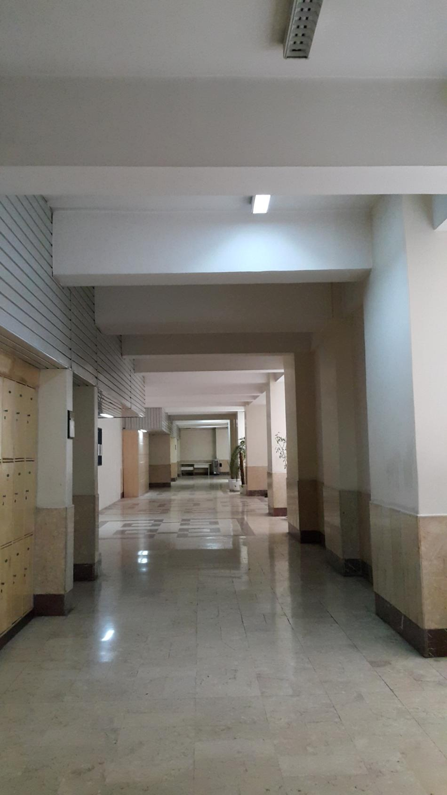
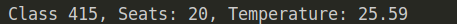
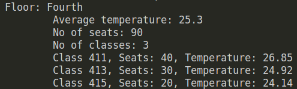

<center>
<h1>
In The Name Of ALLAH
</h1>
<h2>
Advanced Programming - Homework 2
</h2>
<h2>
Dr.Amir Jahanshahi
</h2>
<h3>
Deadline: Friday, 25 Mehr - 23:00
</center>



**Note**: You should **not** use any raw pointers in this homework. Each usage of raw pointers would cost some points!

**Note**: For the sake of functionality, you might need to change some prototypes. But remember, **don't remove any type or keyword at all!**. You're just allowed to add more, not remove!

# Introduction
In this homework, you'll help **Mr.Jeddi** to monitor and control classes of the fourth floor of the faculty. As you know, Mr.Jeddi should be aware of each class at anytime. So let's have a simple program for him to see the number of seats, temperature and name for each class. He could even handle seat changes between classes with your program and some more features. let's begin.

# Classroom
First of all, you must implement the **Classroom** class. This class should have the following private variables.

```c++
std::string name{};
size_t seats{20};  //  No of seats of the class
std::shared_ptr<Classroom> left;  // A smart pointer to the class to the left of this class
std::shared_ptr<Classroom> right;  // A smart pointer to the class to the right of this class
double temperature{27};
```

Your class must also have a ```size_t``` variable named **no**. **no** has the number of all classroom objects created so far.

The following, is a list of your class member functions.

```c++
Classroom(const char* name, size_t seats);
td::shared_ptr<Classroom> getRight();
std::shared_ptr<Classroom> getLeft();
void setRight(std::shared_ptr<Classroom> r);
void setLeft(std::shared_ptr<Classroom> l);
double getTemperature();
size_t noOfSeats();
void show() const;
```

Since names are clear about functionality, just let's talk about **getTemperature** function. This function returns a random number of Gaussian distribution with the mean of 27 and standard deviation of 3 as the temperature of the class after each call. It must also update the **temperature** variable after each call.

The **show()** must display a class just like below.




#  Floor

To introduce the concept of each floor to C++, we have a **Floor** class. This class gets the pointer to just one of the classes and does some operations on the whole floor. Let's see the member variables.

```c++
size_t no_of_classes;
std::string name{};
std::shared_ptr<Classroom> pc;  // pointer to one of the classes in the floor
```

The member functions of the class are listed below.

```c++
Floor(const char* name, std::shared_ptr<Classroom> pc);
size_t noOfClasses();
void show() const;
std::shared_ptr<Classroom> operator[](int i);
bool moveSeats(int source, int dest, size_t no);  // source and dest are indices of classrooms
size_t noOfSeats(int i);  // No of seats of the i-th class starting from pc
size_t noOfSeats();  // No of seats of the whole floor
double getTemperature();  // Average of temperature of all the classes
void setPointer(std::shared_ptr<Classroom> a); // Sets the pc to another class in the floor
```

The **operator[]** returns a shared pointer to the i-th class of the floor, starting from the **pc**. If i is positive, it starts going to the right, and if i is negaive, it goes to the left.

The **moveSeats** returns true if it is possible to move seats (if there is enough seats in the source), else, it returns false.

The **show()** must display a floor just like below.



**Note**: It is always assumed that the first classroom is to the right of the last classroom. In other words, classrooms form a loop together. See gtests for more intuition.

Your classes should also support the following codes.

```c++
auto a = std::make_shared<Classroom>("411", 40);
auto b = std::make_shared<Classroom>("413", 30);
auto c = std::make_shared<Classroom>("415", 20);

a->setLeft(c);
c->setRight(a);
b->setLeft(a);
a->setRight(b);
c->setLeft(b);
b->setRight(c);

Floor f4{"Fourth", a};  //  a is a shared_pointer to a class
show(f4);
```

```c++
auto a = std::make_shared<Classroom>("411", 40);
auto b = std::make_shared<Classroom>("413", 30);
auto c = std::make_shared<Classroom>("415", 20);
const Floor f4{"Fourth", 3, a, b, c};
show(a);
show(f4);
f4.setPointer(b);
f4[0]->show();
```

# main File
You must not alter the **main.cpp** file at all. Just write all your codes in the **aphw1.cpp** and **aphw1.h**. Good luck!


